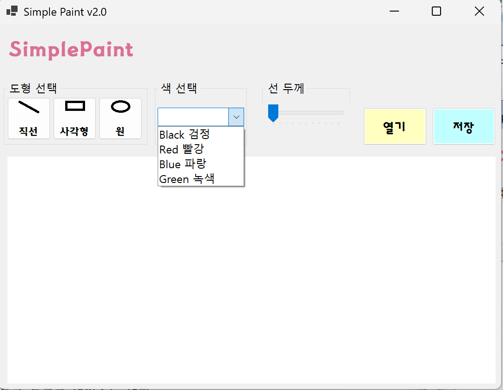
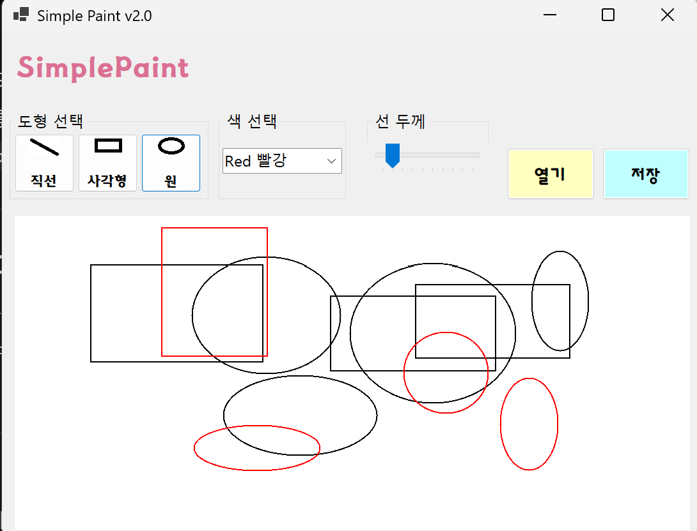
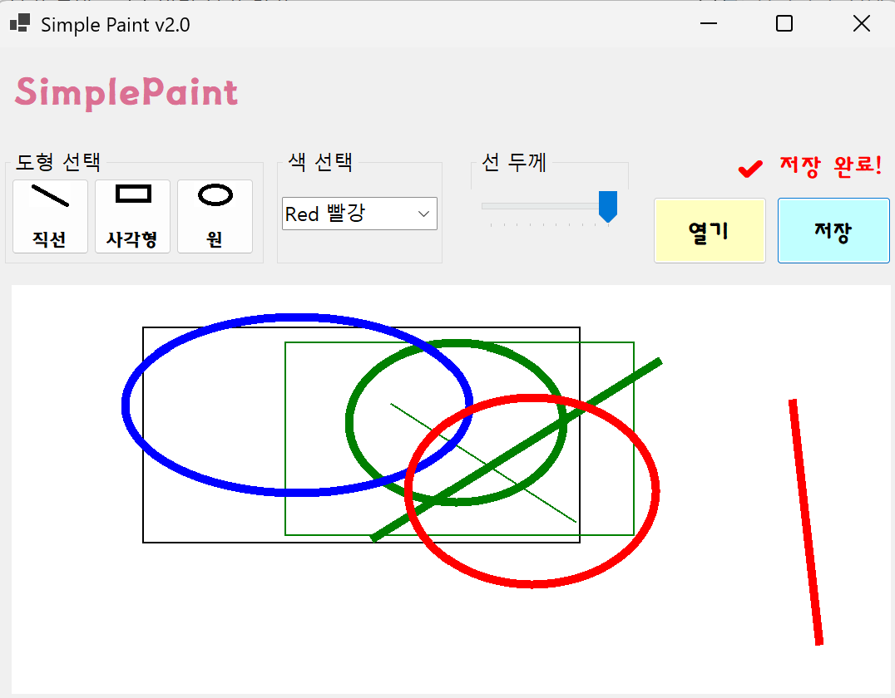
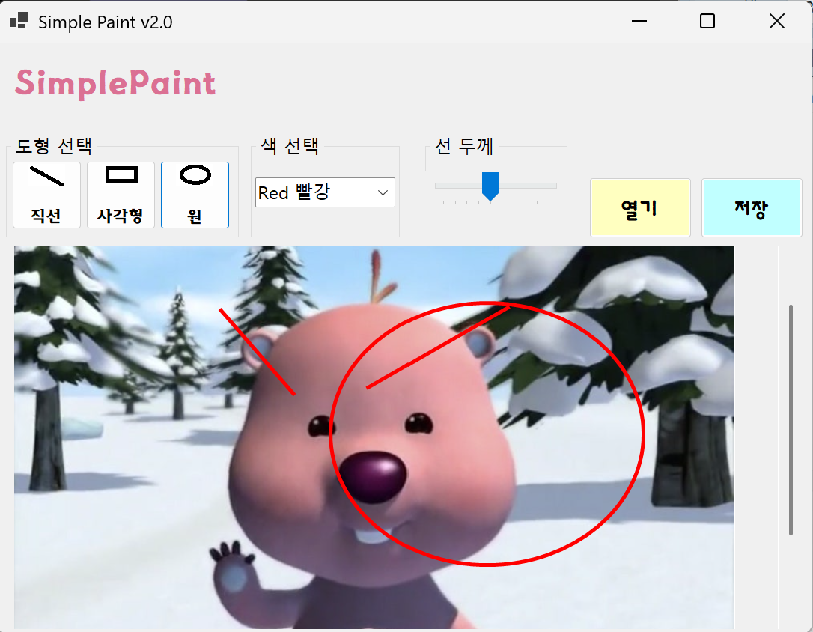

# (C# 코딩) 8주차 과제: Simple Paint
-이름: 하다현 (24018097)

## 개요
- C# 프로그래밍 학습
- 1줄 소개: 두 개의 폴더를 선택하여 파일 목록을 비교하고 관리할 수 있는 Windows Forms 기반 프로그램
- 사용한 플랫폼: C#, .NET Windows Forms, Visual Studio, GitHub, Visual Code
- 사용한 컨트롤: Button, Label, GroupBox, TrackBar, PictureBox
- 사용한 기술과 구현한 기능:
  - Visual Studio를 이용하여 UI 디자인
  - 마우스 드래그를 이용한 그림 그리기 기능 구현
  - 

---

## 실행 화면 (과제1)
- 코드의 실행 스크린샷과 구현 내용 설명

- 구현한 내용( 위 그림 참조 )
  - 컨트롤들을 위치에 맞게 배치하였다.
  - 사용자가 구분하기 쉽게 GroupBox 3개를 만들어 구분하였다. (도형 선택, 색 선택, 선 두께)
  - 도형 선택 Button에는 Image 속성으로 사진을 추가하였고, ImageAlign 속성을 이용해 Text와 Image 위치를 적절하게 배치하였다.
  - TrackBar 컨트롤을 배치해 그림판의 선 두께를 사용자가 조절할 수 있도록 배치하였다.
  - Button 컨트롤을 이용해 파일 입출력을 위한 버튼(btnOpenFile, btnSaveFile)을 배치하여
그림 파일을 열고 저장할 수 있도록 구성하였다.
  - PictureBox(picCanvas)를 이용하여 그림을 그릴 수 있는 캔버스를 구성하였으며, BackColor 속성을 White로 설정하여 배경을 흰색으로 지정하였다.

    cf) 
    - Label("Simple Paint") -> lblAppName
	- GroupBox 3개 만들기
	  - 1번: btnLine, btnRectangle ,btnCircle Button 3개
	  - 2번: cmbColor ComboBox 
	  - 3번: trbWidth TrackBar
	- Button 2개 만들기 (btnOpenFile, btnSaveFile)
	- PictureBox 1개 (picCanvas) - 그림판

 ---

## 실행 화면 (과제2)
- 코드의 실행 스크린샷과 구현 내용 설명

- 구현한 내용 (위 그림 참조)
  - 마우스 드래그를 이용하여 그림을 그릴 수 있는 기능을 구현하였다.
  - 사용자가 마우스를 누르고 이동한 후 놓는 동작을 통해 직선, 사각형, 원을 그릴 수 있도록 하였다.
  - 프로그램은 Bitmap 객체를 이용하여 실제 그림 데이터를 저장하고, Graphics 객체를 통해 해당 비트맵 위에 도형을 그리는 방식으로 구현하였다.
  - 마우스 이벤트(MouseDown, MouseMove, MouseUp)를 활용하여 드래그 시작, 진행, 종료를 처리하였다.
   - MouseDown: 드래그 시작 시 시작 좌표를 저장
   - MouseMove: 드래그 중 현재 좌표를 갱신하고, 점선 형태의 미리보기를 화면에 출력
   - MouseUp: 드래그 종료 시 최종 도형을 비트맵에 그려 화면에 고정
  - Paint 이벤트를 활용하여 드래그 중인 도형을 점선 형태로 미리 표시하도록 구현하였다. 이를 통해 사용자가 도형의 크기와 위치를 직관적으로 확인할 수 있다.
  - DrawShape 함수를 별도로 구현하여 직선, 사각형, 원을 공통된 방식으로 그리도록 하였으며, 코드의 재사용성과 가독성을 항상시켰다.
  - GetRectangle 함수를 이용하여 드래그 방향에 관계없이 올바른 사각형 좌표가 계산되도록 하였다.
  
---

## 실행 화면 (과제3)
- 코드의 실행 스크린샷과 구현 내용 설명

- 구현한 내용 (위 그림 참조)
  - 현재 그림판에 그려진 이미지를 파일로 저장하는 기능을 구현하였다.
  - SaveFileDialog를 사용하여 사용자가 저장할 파일의 경로와 이름을 직접 선택할 수 있도록 구현하였다.
  - 저장 가능한 이미지 형식은 PNG, JPG, BMP 총 3가지로 구성하였다.
  - 사용자가 선택한 파일 확장자에 따라 적절한 ImageFormat을 설정하여 이미지가 저장되도록 구현하였다.
  - Bitmap 객체(canvasBitmap)에 저장된 그림 데이터를 Save 메서드를 이용하여 이미지 파일로 저장하였다.
### 사용된 주요 클래스 및 함수 설명
- SaveFileDialog 클래스
  - Windows Forms에서 파일 저장을 위한 UI 대화상자를 제공하는 클래스이다.
  - ShowDialog() 메서드를 호출하면 사용자에게 저장 창을 표시한다.
- Bitmap 클래스
  - 이미지를 메모리에서 관리하는 객체이다.
  - 현재 그림판에 그려진 모든 그래픽 정보를 저장하고 있는 객체이다.
  - Save() 메서드를 통해 이미지 파일로 저장할 수 있다.
- GraphicsFormat (ImageFormat)
  - 저장할 이미지의 파일 형식을 지정하는 열거형이다.
  - 지원 형식:
    - ImageFormat.Png
    - ImageFormat.Jpeg
    - ImageFormat.Bmp
- Bitmap.Save(string filename, ImageFormat format)
  - Bitmap에 저장된 이미지를 실제 파일로 저장하는 핵심 메서드이다.
  - 첫 번째 인자는 저장 경로 및 파일 이름이다.
  - 두 번째 인자는 저장할 이미지 형식이다.
- EndsWith()
  - 문자열의 끝이 특정 확장자인지 확인하는 함수이다.
  - 파일 확장자(.jpg, .png, .bmp)를 판별하여 저장 형식을 결정하는 데 사용된다.

---

## 실행 화면 (과제4)
- 코드의 실행 스크린샷과 구현 내용 설명

- 구현한 내용 (위 그림 참조)
  - 외부 이미지 파일을 불러와 해당 이미지를 캔버스로 설정하고 그 위에 그림을 그릴 수 있는 기능을 구현하였다.
  - OpenFileDialog를 사용하여 사용자가 이미지 파일을 선택할 수 있도록 하였으며, 선택된 이미지를 Bitmap 객체로 로드하였다.

  - 불러온 이미지의 크기에 맞춰 PictureBox(캔버스)의 크기를 자동으로 조정하도록 구현하였다. 이를 통해 이미지가 잘리거나 왜곡되지 않고 그대로 표시되도록 하였다.

  - 이미지가 PictureBox보다 큰 경우를 대비하여 Panel 컨트롤과 AutoScroll 속성을 사용하여 스크롤바가 자동으로 생성되도록 구현하였다. 이를 통해 큰 이미지도 전체를 확인하면서 작업할 수 있다.

  - Bitmap 객체를 Graphics.FromImage() 메서드를 통해 그래픽 작업이 가능하도록 설정하여, 불러온 이미지 위에 자유롭게 도형을 그릴 수 있도록 하였다.

  - 마우스 드래그 이벤트(MouseDown, MouseMove, MouseUp)를 활용하여 직선, 사각형, 원을 그릴 수 있도록 하였으며, 기존 이미지 위에 그려진 도형이 누적되도록 구현하였다.

  - 확대/축소 기능은 Zoom 개념을 적용하여 PictureBox의 크기 또는 Scale 값을 변경하는 방식으로 구현하였다. 이를 통해 사용자가 이미지의 특정 부분을 확대하거나 전체를 축소하여 볼 수 있도록 하였다.

  - 최종적으로 SaveFileDialog를 이용하여 수정된 이미지(원본 + 그려진 도형 포함)를 PNG, JPG, BMP 형식으로 저장할 수 있도록 구현하였다.

### 프로그램 동작 과정
1. 사용자가 OpenFileDialog를 통해 외부 이미지를 불러온다.
2. 불러온 이미지를 Bitmap으로 변환하여 캔버스로 설정한다.
3. 이미지 크기에 맞게 PictureBox 또는 Panel 크기를 조정한다.
4. 이미지가 큰 경우 자동으로 스크롤바가 생성된다.
5. 사용자가 마우스로 드래그하여 도형을 그린다.
6. 확대/축소 기능을 이용하여 화면 크기를 조절한다.
7. SaveFileDialog를 통해 최종 이미지를 저장한다.

### 핵심 구현 기술
- OpenFileDialog를 이용한 이미지 로드
- Bitmap + Graphics를 이용한 이미지 편집
- PictureBox / Panel을 이용한 캔버스 구성
- AutoScroll을 이용한 스크롤 처리
- Mouse 이벤트를 이용한 드래그 드로잉
- Zoom 기능을 이용한 확대/축소 구현
- SaveFileDialog를 이용한 이미지 저장

---

## 구현 시 어려웠던 점
- 가장 어려웠던 부분은 외부 이미지를 불러왔을 때 기존 그림판 구조(Bitmap + Graphics)를 유지하면서 이미지 위에 다시 그림을 그리는 부분이었다. 단순히 PictureBox에 이미지를 표시하는 것이 아니라 Bitmap 객체로 변환한 후 Graphics.FromImage()를 통해 다시 드로잉 가능한 상태로 만드는 과정이 필요하였다.
- 또한 큰 이미지를 불러왔을 때 화면에 전체가 표시되지 않는 문제가 있었는데, 이를 해결하기 위해 Panel 컨트롤을 사용하고 AutoScroll 속성을 true로 설정하여 스크롤이 자동으로 생성되도록 구성하는 것이 핵심이었다.
- PictureBox와 Panel의 관계를 이해하지 못해 초기에는 이미지가 Panel에 가려지는 문제가 발생했으나, 컨트롤 계층 구조(Parent 설정)를 수정하여 해결하였다.
- 마지막으로 확대/축소 기능 구현 시 PictureBox의 크기와 Bitmap의 원본 크기를 기준으로 zoom 값을 적용하는 방식이 처음에는 헷갈렸지만, 크기 계산을 통해 해결할 수 있었다.